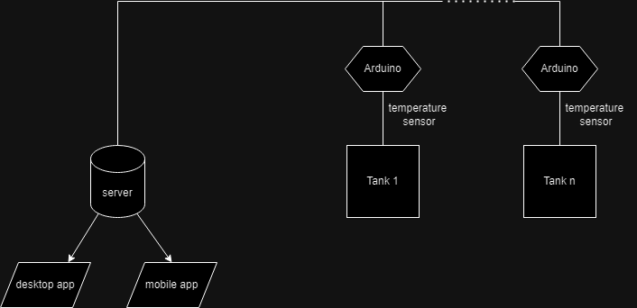

# Vigna38ValvesApp

Vigna38ValvesApp was developed in 2018/2019 as my high school graduation project. As well as earning the maximum score at the last test, this project was finalized to help my parents' winery cooling system making it semi-automized and reachable from an internal desktop app and smartphone devices.

## How does it works

The project is based on a clients-server achitecture were, ideally, the server is ran on a PC internal to the winary and the clients are all the arduino devices (one for each wine tank). The point of the project is to cool down specific tanks where the wine temparature is higher than a value chosen by the winemaker (my dad, hello dad!). This value depends mainly from the external temperature and some other enviromental factors. When the tank temperature exceed the target value the server sends a signal to the tank's Arduino that opens the corrispondent valve so a chilled liquid, that flows through an isolated hydaulic system, can absorb all the wine extra energy (physics here eheheh). In the same way, when the tank temperature is too low, the valve is closed.



### To get ready run

```
sudo apt-get install pip3
pip3 install pyqt5
pip3 install numpy
pip3 install matplotlib
```

### To start the project run

* ubuntu: ```pyuic5 -x ***.ui -o prova.py```
* raspbian: ```exec python3 -m PyQt5.uic.pyuic ***.ui -o prova.py -x```

### FAQ

* Why did you not use Raspberry (or other programmable boards) as client to improve the routing and communications rate?
-> All I had was a laptop, an Arduino, a analog temperature sensor, a Raspberry, a breadboard and some wires. I didn't want to spend more money than I had already spent so i adapted to the situation and used all my items in the best way i tought. If i had to do this again i would clearly use other more efficent tools but let's not forget the main point of this project: yes, friends helped me with some code but overall i did all this job by myself.